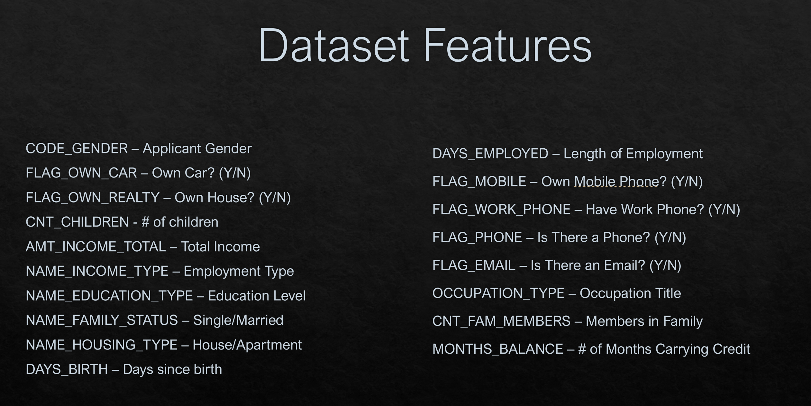

# Machine Learning Consumer Credit Risk

## Setup - Recreating

To get this project setup, first clone the files using a command line. 

```git clone https://github.com/jroelofsz/ml_credit_risk_prediction.git```

Once you have the local files on your machine, follow the steps below:

1. Create a PostgreSQL database
2. Run the ```/sql/Database.sql``` file on your new database.
3. Import the ```application_record.csv``` and ```credit_record.csv``` into their respective tables.
4. Run the notebook cell by cell

## Setup - Playground

In order to setup our playground, you will repeat the steps above but instead, run the ```credit_risk_model_playground.ipynb```.

## Background

This project aims to predict whether an applicant is a good or bad client, a critical task for improving decision-making in areas like credit assessment and risk management. The absence of predefined labels reflects real-world ambiguity, highlighting the need for data-driven insights.

### **Key Considerations for Credit Risk Modeling**

- What defines a "good" vs "bad" applicant?
- Address potential bias from demographic data.
- Ethical implications of dataset analysis.
- Predict consumer creditworthiness.
- Test model performance with fewer features (reduce "noise").
- Optimize using the elbow curve method.


### Dataset Features




### Dataset Target

For our model, we used the STATUS column of our dataset. This column identifies if a user was past due on their debt. 

The breakdown of the STATUS column is as follows:

- 0: 1-29 days past due
- 1: 30-59 days past due
- 2: 60-89 days overdue
- 3: 90-119 days overdue
- 4: 120-149 days overdue
- 5: Overdue or bad debts, write-offs for more than 150 days
- C: paid off that month
- X: No loan for the month

We then mapped out a target column using this column to determine if the applicant was “good” (did not carry debt) or if the applicant was ”bad” (did carry debt).


## Model Training
Overall, we were able to train 5 models during our time constraints. Each iteration attempted to optimized the model in some way to increase accuracy.

Our 4th model performed the best with 71% accuracy. The model also recorded a loss of 55%. We saved all of our models, with our best performing being our final model.

### Attempted Optimizations

Time constraints led us to focus on manual layer manipulation for optimization.
Keras tuning was ruled out due to dataset size and time requirements.

Optimization methods used:
Kernel Regularization: Penalizes large weights to encourage simpler patterns.
Dropout: Randomly drops neurons during training to prevent overfitting and improve generalization.


### Final Model Accuracy

Our final model’s overall accuracy is 71%, with a loss of 55%. 
71% accuracy means the model correctly identifies whether a loan applicant is high-risk or low-risk 71% of the time.

A 55% loss suggests that there is still a considerable error in the model's predictions. For risk assessment, this means the model is making mistakes in assessing the risk level of applicants, which could lead to incorrect identification.

### Problems Encountered

Our first run we had a 100% test. This felt great, but worrisome. We found that we were declaring our “Status” incorrectly. Upon fixing this, we pulled the 61, 65, 70 percent respectfully. 
We also worked with the columns to see if that changed out results, or how the weights changed. Ultimately the model was running through all data to get the most accurate percentage. For example, when removing gender there was only about a 3% change in predictability.


## Summary

This project aims to predict whether credit applicants are "good" or "bad" clients by analyzing consumer data to improve credit risk management. The setup involves cloning a repository, creating a PostgreSQL database, and running a notebook to process the data. The key considerations include defining what constitutes a good or bad applicant, addressing biases from demographic data, and optimizing the model's performance by reducing unnecessary features. The target variable is derived from the ```STATUS``` column, indicating whether an applicant is overdue on their debts. During model training, five models were developed, with the best achieving 71% accuracy, though still facing a 55% loss. Optimization techniques like kernel regularization and dropout were applied to reduce overfitting. Challenges included initial errors in data labeling, but the final model demonstrated robust predictive performance despite minimal improvements from removing certain features.